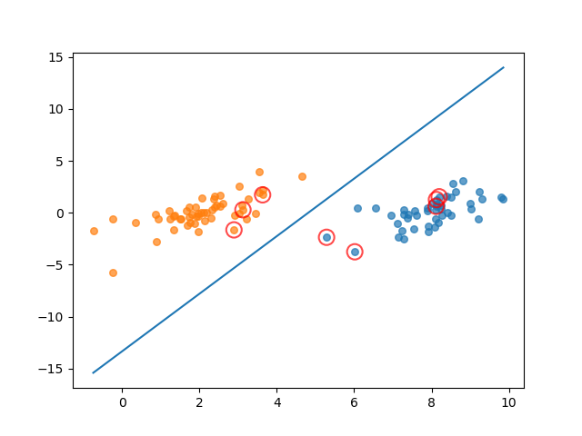
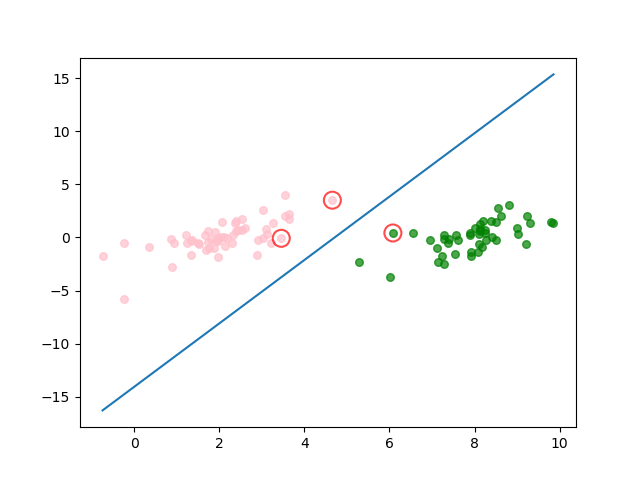
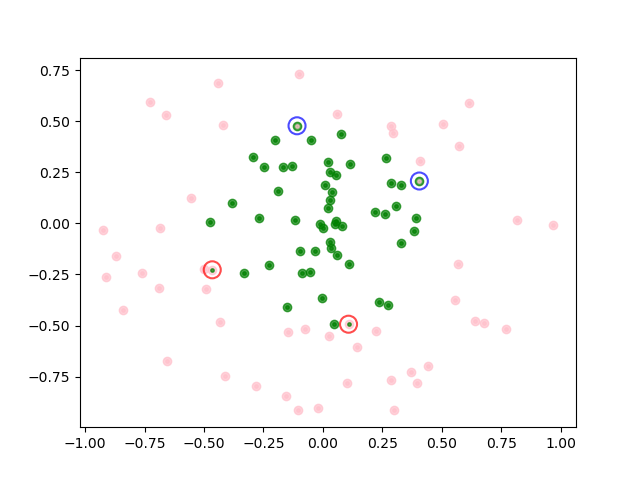

# SVM
Implementation of SVM algorithm.

算法实现参考了《机器学习实战》， 书中的代码在svm_platt_mat.py中， 其中关于smo部分有点问题，导致支持向量找的不对，如下图  

  
修改后的代码在svm_platt_array.py中，  

smo_paper.py是参照[smo论文](https://www.microsoft.com/en-us/research/wp-content/uploads/2016/02/tr-98-14.pdf)中伪代码的实现；  
svm_kernel.py中加入了带核函数  

